# Daftar Isi

- [Kerja Praktek](#kerja-praktek)
- [Fitur](#fitur)
- [Tech Stack](#tech-stack)
- [Prerequisites](#prerequisites)
- [Tahap Instalasi](#tahap-instalasi)
- [Cara Dapatin Google Drive API Credentials](#cara-dapatin-google-drive-api-credentials)

# Kerja Praktek

Kerja Praktek dengan judul "**Rancang Bangun Aplikasi Manajemen Dokumentasi Kegiatan Dengan Layanan Google Drive API
pada Jurusan Informatika**" ini dilakukan di Fakultas Teknik, Jurusan Informatika, Universitas Tanjungpura Pontianak.
Kerja Praktek ini dilakukan selama 3 bulan, mulai dari tanggal 2 Februari 2026 hingga 30 Juni 2026.

Masalah yang dihadapi adalah susahnya melakukan manajemen dokumentasi kegiatan di Teknik Informatika. Selama ini
dokumentasi diupload ke google drive kemudian dibagikan di grup chat (misalnya whatsapp, telegram, dll) menggunakan link
yang didapatkan dari google drivenya. Hal ini menimbulkan beberapa masalah, misalnya :

1. Linknya tenggelam di grup chat karena banyaknya pesan yang masuk sehingga anggota grup chat sulit untuk menemukan
   link dokumentasi kegiatan yang sudah diupload.
2. Link yang dibagikan di grup chat seringkali tidak dapat diakses oleh anggota grup karena masalah izin akses pada
   google drive.
3. Sulitnya mencari dokumentasi kegiatan yang sudah diupload karena linknya tersebar di berbagai grup chat dan tidak
   terorganisir dengan baik.
4. Terkadang terjadi duplikasi dokumentasi kegiatan karena anggota grup chat tidak menyadari bahwa dokumentasi sudah
   diupload sebelumnya.

Oleh karena itu, tujuan dari kerja praktek ini adalah untuk membuat sebuah aplikasi manajemen dokumentasi kegiatan yang
dapat memudahkan jurusan informatika dalam mengelola dokumentasi kegiatan. Aplikasi ini akan menggunakan layanan Google
Drive API untuk mengelola dokumentasi kegiatan yang diupload ke google drive. Dengan aplikasi ini, anggota jurusan
informatika dapat dengan mudah mengupload, mengelola, dan mencari dokumentasi kegiatan yang sudah diupload tanpa harus
khawatir tentang masalah izin akses atau duplikasi dokumentasi.

# Fitur

1. **Upload Dokumentasi Kegiatan** : Anggota jurusan informatika dapat mengupload dokumentasi kegiatan ke google drive
   melalui aplikasi. Aplikasi ini menggunakan layanan Google Drive API untuk mengelola dokumentasi kegiatan yang
   diupload ke google drive.

2. **Manajemen Dokumentasi Kegiatan** : Anggota jurusan informatika dapat mengelola dokumentasi kegiatan yang sudah
   diupload ke google drive melalui aplikasi. Aplikasi menyediakan fitur untuk menghapus dokumentasi ataupun
   menambahkan dokumentasi (kalau ternyata ada nambah ataupun lupa upload) ke kegiatan yang sudah diupload ke google
   drive.

3. **Pencarian Dokumentasi Kegiatan** : Anggota jurusan informatika dapat mencari dokumentasi kegiatan yang sudah
   diupload. Aplikasi menyediakan fitur untuk mencari dokumentasi kegiatan berdasarkan nama, tanggal, atau kategori
   kegiatan.

4. **User Management** : Aplikasi ini akan menyediakan fitur untuk mengelola pengguna aplikasi. Fitur ini akan
   memungkinkan admin aplikasi untuk menambahkan, mengedit, dan menghapus pengguna aplikasi.

5. **Kategori Kegiatan** : Aplikasi menyediakan fitur untuk mengelompokkan dokumentasi kegiatan berdasarkan
   kategori kegiatan. Fitur ini akan memudahkan dalam mencari dokumentasi kegiatan yang
   sudah diupload ke google drive berdasarkan kategori kegiatan.

6. **Statistik** : Aplikasi menyediakan fitur untuk menampilkan statistik dokumentasi kegiatan yang sudah diupload
   ke google drive. Fitur ini akan menampilkan statistik jumlah dokumentasi kegiatan yang sudah diupload ke google drive
   berdasarkan kategori kegiatan, bulan, dan tahun.

# Tech Stack

ini adalah beberapa teknologi yang digunakan dalam kerja praktek ini :

1. **Laravel** : Laravel adalah framework PHP yang digunakan untuk membangun aplikasi web. Laravel menyediakan
   berbagai fitur yang memudahkan pengembangan aplikasi web, seperti routing, middleware, dan lain-lain.

2. **Google Drive API** : Google Drive API adalah sebuah layanan yang disediakan oleh Google untuk mengelola file yang
   disimpan di google drive. Google Drive API menyediakan berbagai fitur untuk mengelola file di google drive, seperti
   upload, download, delete, dan lain-lain.

3. **MySQL** : MySQL adalah sebuah _Relational Database Management System_ (RDBMS) yang digunakan untuk menyimpan data
   aplikasi. MySQL menyediakan berbagai fitur untuk mengelola basis data, seperti query, indexing, dan lain-lain.

4. **TailwindCSS** : TailwindCSS adalah sebuah framework CSS yang digunakan untuk membangun tampilan aplikasi web.
   TailwindCSS menyediakan berbagai kelas CSS yang memudahkan pengembangan tampilan aplikasi web, seperti flexbox, grid,
   dan lain-lain.

5. **Livewire** : Livewire adalah sebuah library Laravel yang digunakan untuk membangun aplikasi web interaktif.
   Livewire memungkinkan pengembang untuk membuat komponen interaktif tanpa harus menulis kode JavaScript secara
   langsung.

# Prerequisites

> [!NOTE]
> Instalasi PHP dan MySQL bisa dipersingkat dengan install XAMPP, tapi cek versi PHP dari XAMPP untuk memastikan
> kompatibilitas dengan Laravel 12.

1. **PHP** : Pastikan PHP sudah terinstall di komputer. Project ini pake Laravel 12 yang butuh PHP versi 8.2 atau yang
   lebih baru.

2. **MySQL** : Pastikan MySQL sudah terinstall di komputer Anda. Laravel membutuhkan MySQL untuk menyimpan data
   aplikasi.

3. **Composer** : _Dependency manager_ untuk PHP yang digunakan untuk mengelola dependensi aplikasi
   Laravel.

4. **Google Cloud Account** : Anda perlu memiliki akun Google Cloud untuk menggunakan Google Drive API. Pastikan Anda
   sudah memiliki akun Google Cloud dan sudah membuat project di Google Cloud Console.

5. **Google Drive API Credentials** : Anda perlu membuat kredensial untuk Google Drive API di Google Cloud Console.
   Pastikan Anda sudah membuat kredensial untuk Google Drive API dan mendapatkan Client ID dan Client Secret yang
   diperlukan untuk mengakses Google Drive API.

6. **Node.js dan npm** : Node.js buat javascript runtime, sedaangkan npm (Node Package Manager) buat mengelola _package_
   JavaScript yang dibutuhkan untuk frontend.

7. **Git** : supaya tinggal clone aja projectnya

8. **IDE atau Code Editor** : Ini bebas aja sih, boleh pake VSCode, PhpStorm, Sublime Text, atau bahkan Notepad++.

9. **Browser** : ini yang paling penting.

# Tahap Instalasi

1. Clone repository ini ke komputer Anda menggunakan perintah berikut di terminal atau command prompt :
   ```bash
   git clone https://github.com/rikarani/kerja-praktek.git
   ```

2. Masuk ke direktori project yang sudah di-clone :
   ```bash
   cd kerja-praktek
    ```

3. Install dependensi laravel :
   ```bash
   composer install
   ```

4. Install dependensi frontend :
    ```bash
    npm install
    ```

5. copy file `.env.example` menjadi `.env` :
    - kalo di windows pake command ini
   ```bash
   copy .env.example .env
   ```

    - kalo di linux atau macOS pake command ini
    ```bash
    cp .env.example .env
    ```

6. Generate APP_KEY untuk laravel :
   ```bash
   php artisan key:generate
   ```

7. Konfigurasi file `.env`
    - Default password untuk user
    ```env
    APP_DEFAULT_PASSWORD=
    ```
    - Faker Locale
    ```env
    APP_FAKER_LOCALE=
    ```
    - Koneksi Database disesuaikan aja dengan komputer masing-masing
    ```env
    DB_CONNECTION=mysql
    DB_HOST=
    DB_PORT=
    DB_DATABASE=
    DB_USERNAME=
    DB_PASSWORD=
   ```
    - Google Drive API Credentials, cara dapatinnya bisa cek [di sini](#cara-dapatin-google-drive-api-credentials)
   ```env
   GOOGLE_DRIVE_CLIENT_ID=
   GOOGLE_DRIVE_CLIENT_SECRET=
   GOOGLE_DRIVE_REFRESH_TOKEN=
   GOOGLE_DRIVE_FOLDER=
   ```

8. Jalankan migrasi sekalian ama seedernya :
   ```bash
   php artisan migrate --seed
   ```

9. Jalankan server laravel :
    ```bash
    php artisan serve
    ```

10. Jalankan server frontend :
    ```bash
    npm run dev
    ```

11. Buka browser dan akses aplikasi di `http://localhost:8000`

# Cara Dapatin Google Drive API Credentials

1. Buka [Google Cloud Console](https://console.cloud.google.com/).

2. Buat project baru atau pilih project yang sudah ada.
   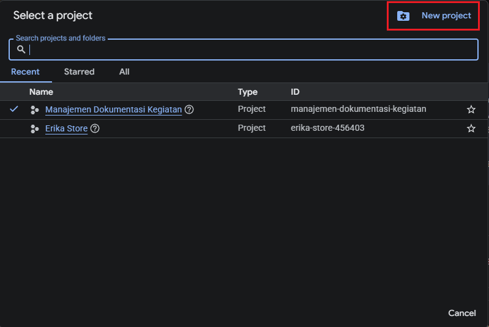

3. Masuk ke bagian "APIs & Services".
   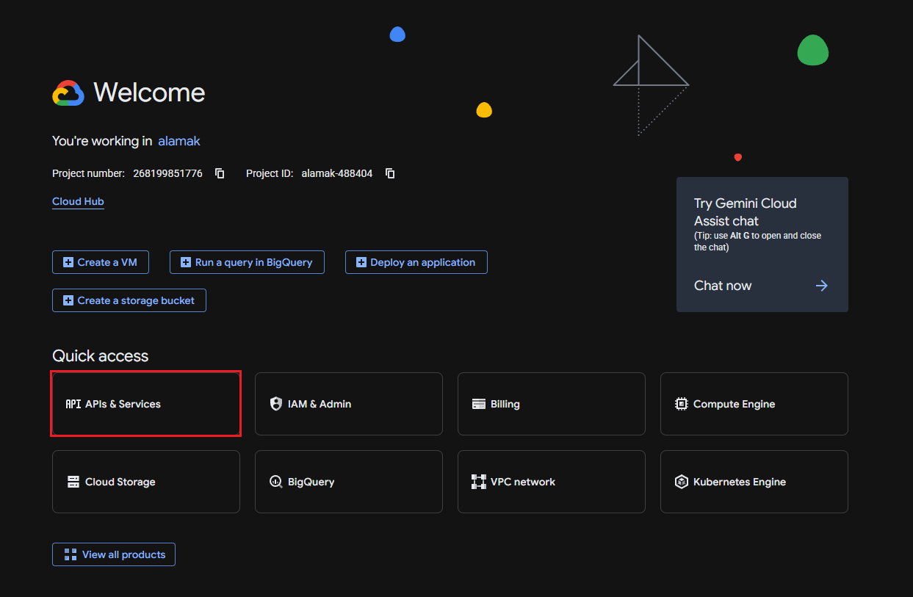

4. Klik "Enable APIs and Services".
   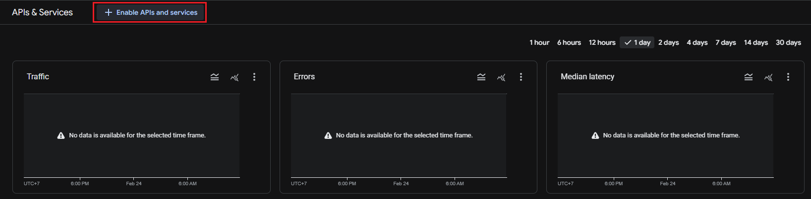

5. Scroll kebawah dikit nanti ketemu "Google Drive API", klik aja.
   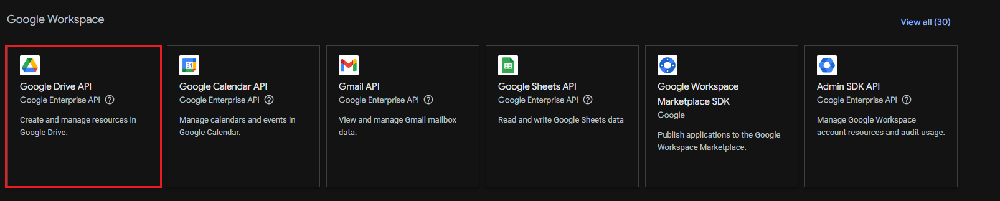

6. Klik "Enable" buat aktifin Google Drive API.
   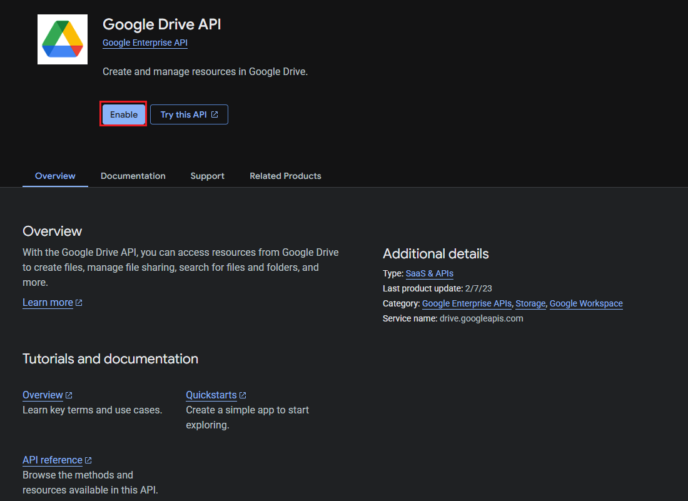

7. Lanjut ke Tab "Credentials", kemudian klik "Create Credentials" dan pilih "OAuth client ID".
   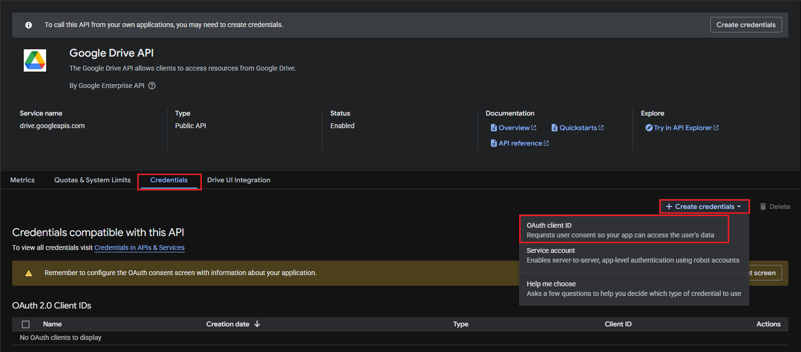

8. Untuk pertama kali, biasanya diminta buat atur _Consent Screen_ terlebih dahulu. Klik aja "Configure consent screen",
   kemudia klik "Get started".
   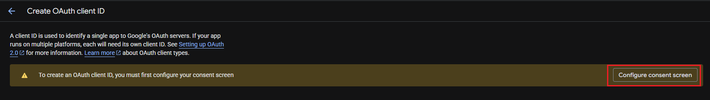
   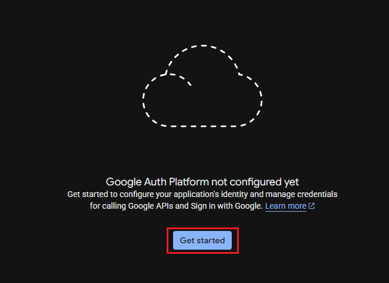

9. Step 1, isi nama aplikasi dan email support, lalu klik "Next".
   

10. Step 2, pilih "External", lalu klik "Next".
    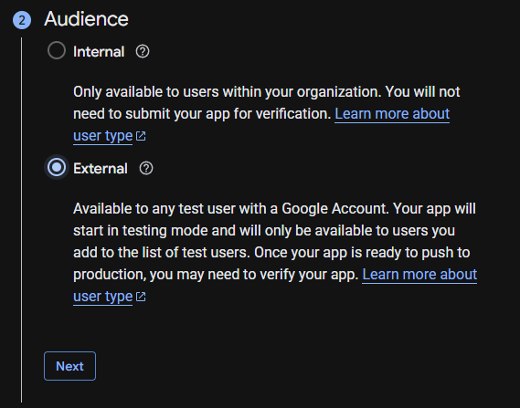

11. Step 3, Masukkan Email buat Contact Information, terus klik "Next".
    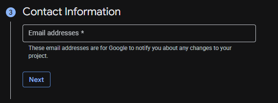

12. Terakhir, centang checkbox, klik "Continue", lalu klik "Create".
    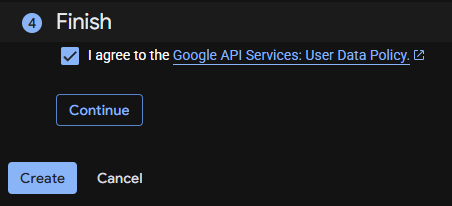

13. Setelah selesai setup consent screen, klik "Create OAuth client".
    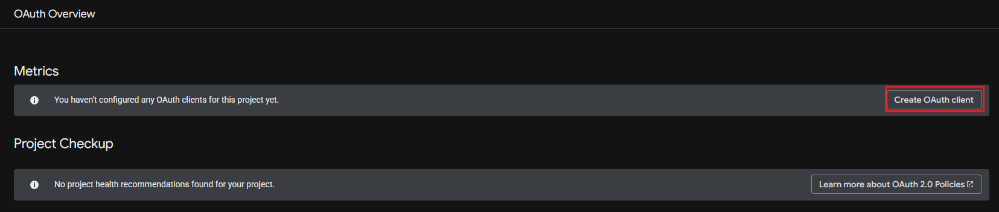

14. Untuk "Application type", pilih "Web application".
    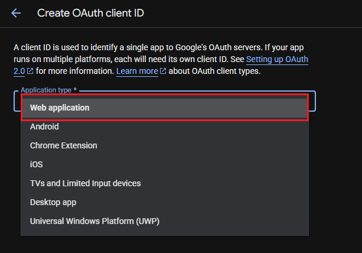

15. Bagian "Name" bisa diisi sesuai keinginan, misalnya "Aplikasi Kerja Praktek".
    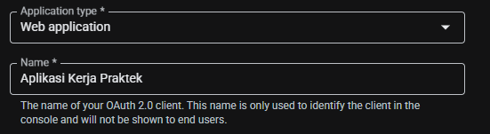

16. Di bagian "Authorized JavaScript origins", klik "Add URI" dan masukkan `http://localhost:8000`.
    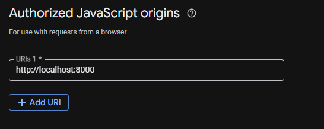

17. Di bagian "Authorized redirect URIs", klik "Add URI" dan masukkan `http://localhost:8000/auth/google/callback`.
    

18. Kalo dah selesai, nanti akan muncul pop-up yang berisi Client ID dan Client Secret.
    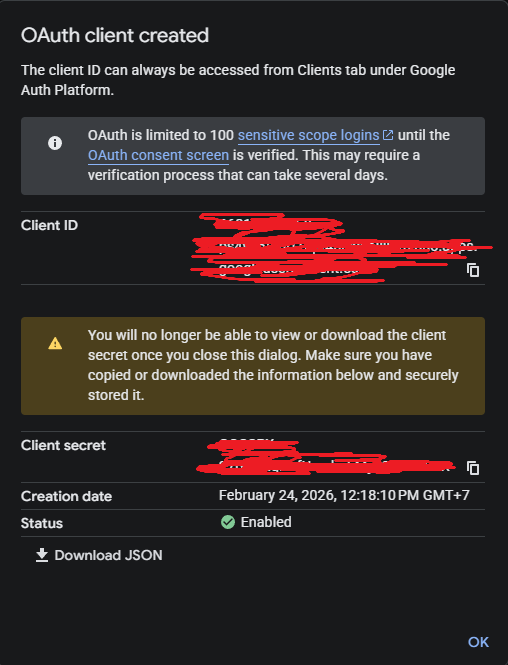

19. Taruh Client ID dan Client Secret di file `.env`.
    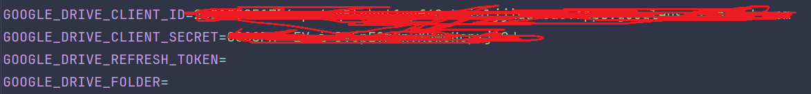

20. Nah untuk dapetin _Refresh Token_ tuh tinggal buka URL `http://localhost:8000/token`, nanti langsung redirect ke
    milih akun google
    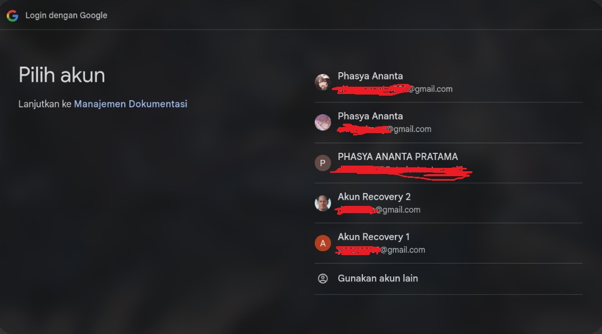

21. Kalo muncul gini, lanjutkan aja
    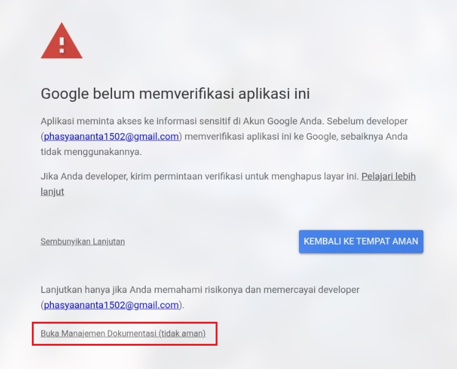

22. Centang aja semua _permission_ yang diminta, trus klik "Lanjutkan"
    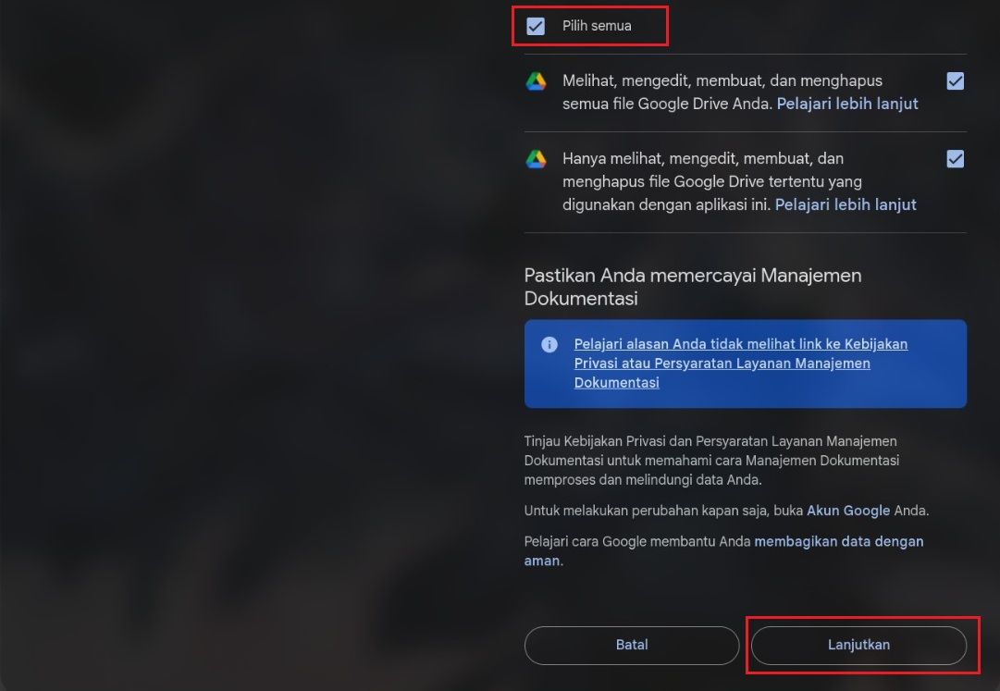

23. Setelah itu bakal muncul halaman yang isinya banyak data. Karna yang dibutuhkan cuma "refresh_token", langsung aja
    copas trus taruh di file `.env`
    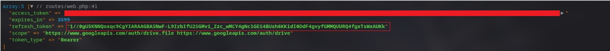

24. Nanti hasil akhirnya kek gini, untuk value "GOOGLE_DRIVE_FOLDER" mah disesuaikan aja dengan nama folder yang udah
    dibuat di google drive buat nampung dokumentasi kegiatan
    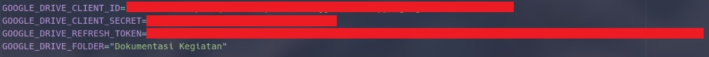
